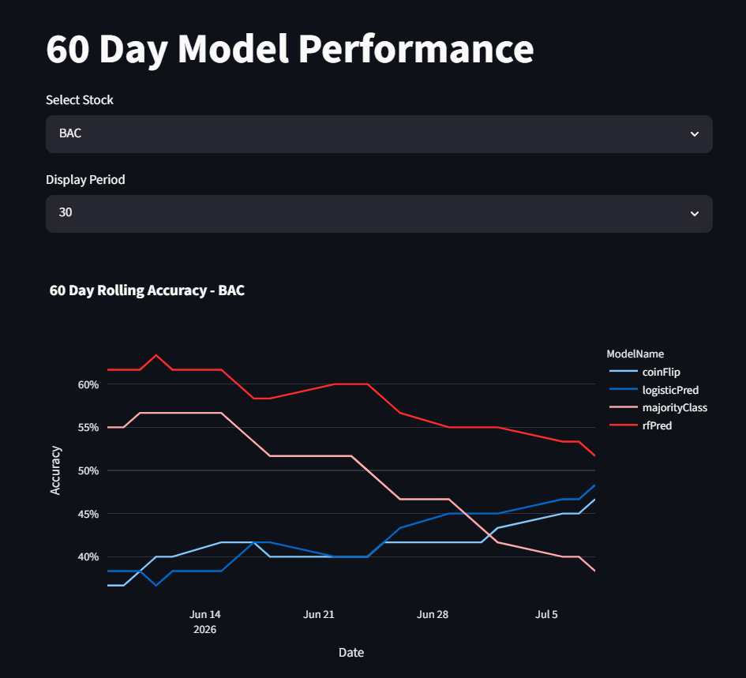
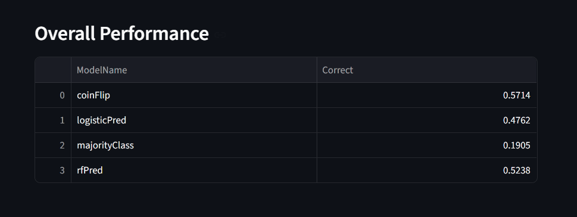

# Directional Prediction Application

## Overview

The **Directional Prediction Application** is an interactive stock market dashboard built with **Python** and **Streamlit** that predicts the next trading day's price direction for selected financial stocks. The application allows users to compare several predictive models, evaluate their historical performance, and visualize model accuracy over multiple time horizons.

This project was developed to demonstrate the complete machine learning workflow, from data collection and feature engineering to model training, evaluation, and interactive visualization.

---

## Features

* Predicts the next trading day's price direction (Up/Down) for selected stocks.
* Compare the performance of multiple prediction models.
* View model accuracy over **30-day**, **60-day**, and **90-day** evaluation windows.
* Display the **10-day rolling accuracy** of every model across all supported stocks.
* Compare each model's overall historical prediction accuracy.
* Interactive Streamlit interface for exploring model performance.

---

## Stocks Included

* Bank of America (BAC)
* Truist Financial (TFC)
* Wells Fargo (WFC)

---

## Prediction Models

The application evaluates several approaches to predicting stock price direction:

* Logistic Regression
* Random Forest
* Markov Chain
* 5-Day Majority Vote
* 5-Day Stochastic Model
* Coin Flip (Baseline Model)

The Coin Flip model serves as a baseline for comparison, allowing users to evaluate whether statistical and machine learning models outperform random chance.

---

## Feature Engineering

Each model is trained using technical indicators commonly used in financial analysis, including:

* 50-Day Simple Moving Average (SMA)
* 200-Day Simple Moving Average (SMA)
* Relative Strength Index (RSI)
* Bollinger Bands
* Average True Range (ATR)
* Rolling Variance
* Trading Volume

These engineered features capture market momentum, volatility, trend strength, and trading activity.

---

## Machine Learning Pipeline

1. Download historical stock data.
2. Store and manage data using SQL Server.
3. Generate technical indicators through feature engineering.
4. Train multiple predictive models.
5. Evaluate model performance using historical data.
6. Present results through an interactive Streamlit dashboard.

---

## Technologies Used

* Python
* Streamlit
* SQL Server
* SQL
* pandas
* scikit-learn
* Plotly
* SQLAlchemy
* pyodbc
* yfinance

---

## Project Goals

This project demonstrates several core data science and analytics skills:

* Data acquisition
* SQL database management
* Feature engineering
* Machine learning model development
* Model evaluation
* Data visualization
* Dashboard development

The objective is not to guarantee profitable trading strategies, but to compare different statistical and machine learning methods for predicting stock price direction and to provide an interactive environment for exploring their performance.

---

## Future Improvements

Potential enhancements include:

* Deploying the application to the cloud.
* Connecting to an Azure SQL Database.
* Expanding the application to additional stocks and market sectors.
* Adding advanced machine learning models such as XGBoost and neural networks.
* Incorporating additional technical indicators and market features.
* Implementing backtesting and portfolio performance analysis.

---

## Disclaimer

This project is intended for educational and demonstration purposes only. The predictions generated by the application should not be interpreted as financial advice or investment recommendations.

## Screenshots

### Title and Ten Day Rolling Accuracy

### 60-Day Model Comparison

### Overall Model Accuracy

